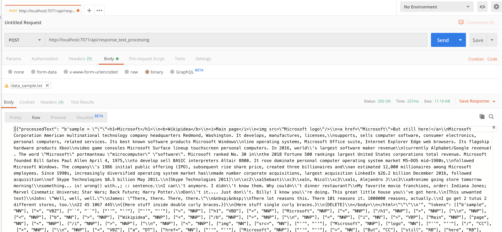

### Step 3: Modify the basic Azure Function.

In this step we'll learn how we can modify our basic Azure Function using the code we prepared in [step1_refactoring](). Since there is more than one way to 
correctly refactor code I prepared a simple Python function in the shared_code directory we can all use.

As a challenge after finishing this step, try to deploy more functions we created in the refactoring step and create tests.

## Receive and return data

For the sake of this tutorial, we’re going to install the Natural Language Processing library [nltk](https://www.nltk.org/install.html).
In the root of your Functions project (after stopping the execution of your function project) run:

```bash
pip install nltk
pip install numpy
```

Once you’ve done that, run

```bash
pip freeze > requirements.txt 
```

to keep a record of the libraries you’ve installed in this environment. This is the file that we will use when we publish our Functions project.

The [shared_code directory]() contains functions that preform simple Natural Language Processing, which we gonna use in our `response_text_processing` function.

Move the [shared_code directory]() to your FunctionPythonHTTPExample folder.

```bash
cd ~/Azure-functions-beginner-mar2020/workshop/part2_azure_functions
mv shared_code FunctionPythonHTTPExample
```

Edit the `__init.py__`:

```python
import logging
import json

import azure.functions as func

from ..shared_code import nlp_text_processing as tp


def main(req: func.HttpRequest) -> func.HttpResponse:
    logging.info('Python HTTP trigger function processed a request.')

    file_sent = None
    text = ""

    try:
        file_sent = req.get_body()
    except ValueError as e:
        logging.error("Value Error: ", e)
        raise ValueError
    else:
        text = str(file_sent)

    processed_text = tp.remove_stop_words(text)
    tokens = tp.tokenize_text(processed_text)
    entities = tp.get_entities(tokens)

    if file_sent:
        return func.HttpResponse(
            json.dumps([ {
                "processedText": processed_text,
                "tokens": tokens,
                "entities": entities
            } ]),
            status_code=200
        )
    else:
        return func.HttpResponse(
            "Please pass a file in the request body",
            status_code=400
        )

```
Run the edited Python function, using the `func host` command from the `part2_azure_functions` directory:

```bash
# Run the functions locally:
cd ~/Azure-functions-beginner-mar2020/workshop/part2_azure_functions/FunctionPythonHTTPExample
func host start
```

Then go to Postman and make the following POST request using the [data_sample]() file:

<p>

</p>

In the response the stopwords should have been removed, then the text should have been tagged and finally there should be a few recognized entities.
