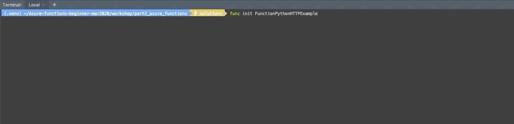
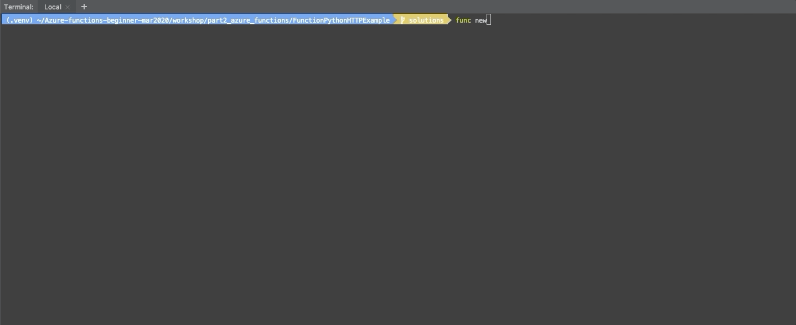

### Step 2: Creating our first Azure function.

## What are Azure Functions?

In a traditional cloud model, you need to take care of server management and environment configuration. While this is the right way to handle a lot 
of scenarios, sometimes you just need to run a small chunk of code to handle some kind of event.

>> Azure Functions are event-driven serverless compute platform that allows you to run a piece of code written on one of the supported programming 
languages – Java, C#, or Python when a trigger linked to an event is fired. An event after which your application is executed can be uploading a file 
to the Azure Storage, making changes in CosmosDB, getting an HTTP request, message queues, timers etc. 

After configuring a function to run when an event occurs, your application will be executed automatically after each new event. 
Since we don't care about server management, we can focus on your application — this is why Azure Functions are referred to as serverless.
Serverless architecture also handles the case where you might have resources that are underutilized, since with Azure Functions, you only pay for 
the related execution costs. In many cases, this approach can be cheaper than provisioning and running code in the traditional cloud model. 
Azure also handles all the resource scaling and load balancing! This gives you a lot of flexibility in how you develop your app.

Furthermore, Azure Functions have rich integrations (or bindings) with other Azure services such as Cosmos DB, Event Hub, and many other services.

### What's a good use case for Azure Functions?

For example, let’s say you have an application that allows users to upload a photo, and it stores these photos in Azure Storage. Now, let's say you 
want to resize the image. Since this code runs based on an event (the file upload), Azure Storage can fire an event and trigger the execution of the 
code to handle the image resize. Where does this piece of code live, if we are not deploying a server? Well, that’s where Azure Functions come into play.

At this point, I’m sure you’re ready start writing your first Azure Function. So let’s get to it.

## Building your first serverless app using Azure Functions

Once you have all the requirements installed, open your terminal.

#### Let's clone the repository first. 
In your terminal run:

```bash
git clone https://github.com/pyladiesams/Azure-functions-beginner-mar2020
cd Azure-functions-beginner-mar2020/workshop/part2_azure_functions
```

#### Let's create a virtual environment.
In your terminal run:

**Mac & Ubuntu:**
```bash
python3 -m venv .venv
source .venv/bin/activate
```

**Windows:**\
If you use `cmd`:
```bash
<venv> \Scripts\activate.bat 
```

If you use `PowerShell`:
```bash
<venv> \Scripts\Activate.ps1 
```

#### Let's create a new Azure Functions project.

We'll create a new Azure Functions project using the `Azure Functions Core Tools` command, `func`. Run `func init` to create an empty Azure Functions project:

```bash
func init FunctionPythonHTTPExample
```

Choose '3' (Python) as worker runtime, and then press Enter.

If it happens according to the gif below it is because the project was installed successfully!

<p>

</p>

#### Let's create a new Azure Functions template.

In this step we'll generate some boiler-plate code to kick start building our Azure functions.
`cd` into the new project directory and use `func new` to create a new Azure function:

```bash
func new
```

In version 2.x, when you run `func new` you are prompted to choose a template in the default language of your function app, then you are also prompted 
to choose a name for your function. 

For the type of function, select ‘5’ (HTTP trigger) and name the function `response_text_processing`.

If it happens according to the gif below it is because the project was installed successfully!
<p>

</p>

And… Congrats! You have now created a new Azure function, and you can already test what the HTTP trigger template does.
You can see from the output above that `func` has created a Python file, `__init__.py` and a config file, `function.json`.

Run the boiler-plate Python function, using the `func host` command:

```bash
# Run the functions locally:
func host start
```

Look at the gif:
<p>

</p>

If you load up your browser at the URL `http://localhost:7071/api/response_text_processing?name="insert your name here"` 
you should see “Hello "your name"!”.

Well done! You’ve written your first Azure Function!
