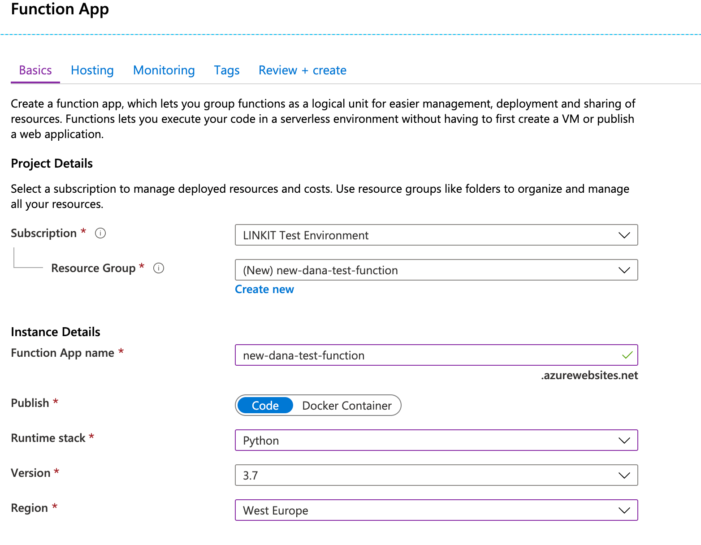
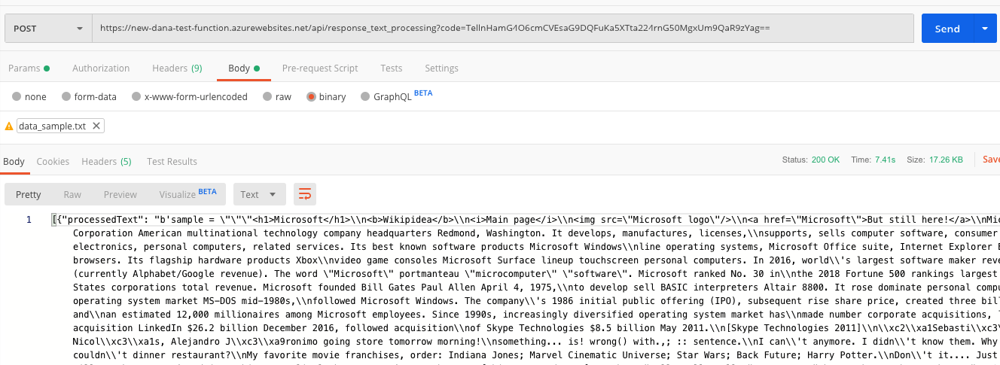
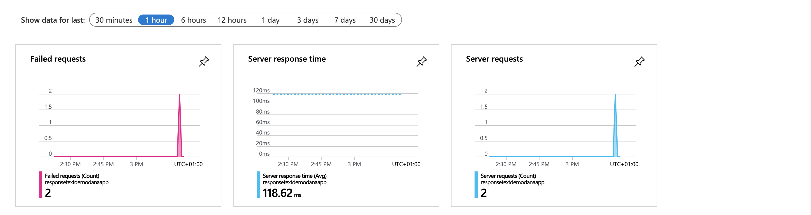

### Step 4: Deploy your Azure function.

In this step we'll deploy the function we created in Step 3.

## Creating a Function App on Azure
What you’ve done so far is great – as long as your development machine is on, and you have console windows open running `func host`. But, that’s 
impractical. Let's see how we can deploy the code we’ve written to Azure Functions, so Microsoft can host it for you!

To interact with Azure’s servers, we’ll use the Azure CLI command, `az`.

I'm gonna show you how you can deploy your app using the Azure UI and from your command line.

### Option 1: Azure UI

From the Azure portal, click on Create a Resource and create a new Function App:

<p>

</p>

Choose a unique name, select Linux as OS, choose to publish Code, and select Python as the Runtime Stack. 
Once it’s deployed, go back to your command prompt.

First you need to log into your Azure account by running `az login`. 
It’ll load up the browser and ask you to log in to your Azure account. 

```bash
# Connect `az` to your Azure account:
az login
```

Install [Docker](https://docs.docker.com/install/) and make sure it is running, then run:

```bash
func azure functionapp publish APP_NAME --build-native-deps
```

where the APP_NAME is the name of the Function App you just created in Azure.

To make sure everything works as expected, open Postman again and just replace the endpoint with the invoke URL provided after deployment 
(with the code parameter, otherwise you’ll get an Unauthorized Access error).

<p>

</p>

Now we can use this Python function anywhere!

### Option 2: Command line

First you need to log into your Azure account by running `az login`. 
It’ll load up the browser and ask you to log in to your Azure account. 

```bash
# Connect `az` to your Azure account:
az login
```

Now, you’ll run the three az commands below. 
The only thing you’ll need to change is to replace `MYAPPFUNCTIONSTORE` with something globally unique. 
The actual name you pick isn’t important – it’s just a place to store the data for your running functions, and won’t be seen by the users. 
You’ll also need to change `MYFIRSTAPP` to something globally unique.

```bash
# Create a resource group:
az group create --name myResourceGroup --location westeurope

# Create a storage account for storing your function data:
az storage account create --name "MYAPPFUNCTIONSTORE" \
    --location westeurope --resource-group myResourceGroup \
    --sku Standard_LRS

# Create a function app for grouping your functions together:
az functionapp create --resource-group myResourceGroup --os-type Linux \
    --consumption-plan-location westeurope  --runtime python \
    --name "MYFIRSTAPP" --storage-account  "MYAPPFUNCTIONSTORE"
```

```bash
Publish Your Function to Azure
func azure functionapp publish MYFIRSTAPP --build remote
```
 
You can check that your function is deployed properly by creating a POST reguest in Postman using `https://MYFIRSTAPP.azurewebsites.net/api/response_text_processing?code=<USE_YOUR_CODE_HERE>` 
and confirming that the JSON output is being correctly produced.

### Troubleshooting
To troubleshoot your app go to the Monitoring section in the Azure portal.

<p>

</p>

## Cleaning up
Don't forget to delete the created resource after the workshop ends. You can delete the resource by using the Azure portal.
Go to Resource Groups, click on the resource you want to delete and click delete resource group.
Or by using Azure CLI, just run the following command in the terminal: 
```bash
az group delete --name MyResourceGroup
```

## Where to go next?
Now that you’re here, you’ve successfully written your first Python Azure function and can understand what happens when the function works according 
to your expectations — and also what happens when it fails. Like most things, however, this barely scratches the surface of the power of Azure Functions. So what now?

For starters, here are just a few ideas:

* You can build a [serverless web application](https://docs.microsoft.com/en-us/azure/architecture/reference-architectures/serverless/web-app).
* Build,train and deploy a [Machine Learning model](https://azure.microsoft.com/en-us/free/machine-learning/search/?&ef_id=Cj0KCQiA1-3yBRCmARIsAN7B4H1RepL2p1tSCOK06GtxfTVeimTE4Ccc1PJIEiZeV9ku_2GMyAh8a6waAmsNEALw_wcB:G:s&OCID=AID2000098_SEM_L0hncz7b&MarinID=L0hncz7b_369039617729_azure%20machine%20learning_e_c__75540808959_kwd-298261819911&lnkd=Google_Azure_Brand&dclid=CMGAtqLA-ecCFZYK4AodYmUNOA).

## References

* https://docs.microsoft.com/en-us/azure/azure-functions/functions-reference-python
* https://docs.microsoft.com/en-us/azure/azure-functions/functions-best-practices
* https://docs.microsoft.com/en-gb/azure/azure-functions/functions-create-first-azure-function-azure-cli?pivots=programming-language-python&tabs=bash%2Cbrowser
* https://azure.microsoft.com/en-us/blog/taking-a-closer-look-at-python-support-for-azure-functions/
